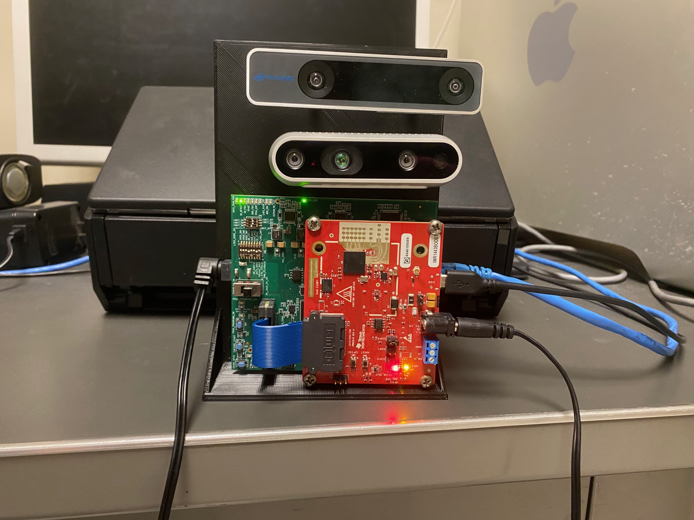
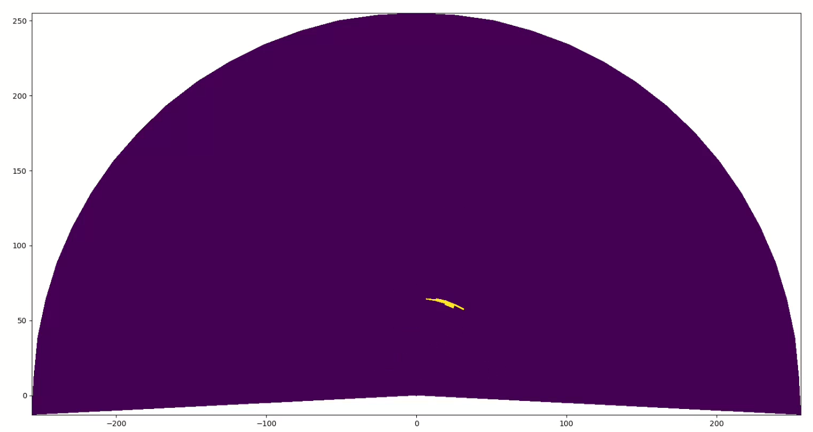
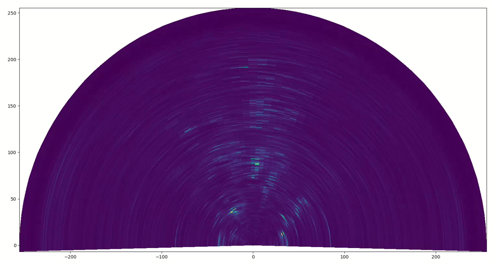
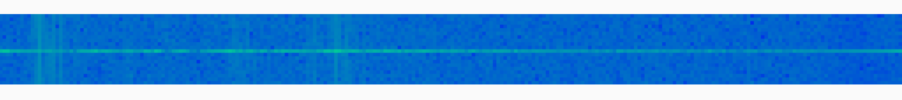

# FMCW mmWave
ROS 2 Package (C++) for TI IWR1443BOOST and TI DCA1000EVM FMCW mmWave Radar System

This project is based off of the work done for the RaDICaL SDK: 
https://moodoki.github.io/radical_sdk/

https://publish.illinois.edu/radicaldata/

This has only been tested on Ubuntu 22.04.5

## Getting started
This repository includes the ROS 2 package written in C++ with real time visualization scripts written in Python. There is also an example script for working with prerecorded data in the .db3 format, which is the format for ROS 2 bags.

I recommend reading the ROS 2 documentation to set up your ROS 2 environment and workspace, then adding the package to the workspace within the `cpp_mmwavec/src` folder.



## How to use
Once ROS 2 has been configured and you have added the cpp_mmwavec package files to the src of your ROS 2 workspace, follow the below instructions.

The ROS 2 package is defined as "cpp_mmwavec" in the package.xml file, but this can be changed.

1. Open terminal

2. To build the ROS 2 package use `colcon build --packages-select cpp_mmwavec`

3. Access to the serial port must be granted, in my setup this meant `sudo chmod 666 /dev/ttyACM0`

4. Finally `ros2 run cpp_mmwavec mmwave [config name]`

Regarding the config name, if the config is "short_range.cfg" , the config name is "short_range"

## Real-time Visualizations
To use one of the sample real-time visualizations, open a new terminal tab or window at `cpp_mmwavec/scripts` and use `python3 ./doppler.py` to display a range-doppler plot. Included visualization scripts include 

1. Range-Azimuth FFT: `2d_fft.py`

Shown: Range-Azimuth data transformed to Cartesian plane. FFT with zero-padding method for angle estimation applied in real-time. CFAR detection without including stationary bin. Person walking towards stationary radar.


2. Range-Azimuth from Capon beamforming: `2d_capon.py`

Shown: Range-Azimuth data transformed to Cartesian plane. Capon beamforming applied in real-time. Person walking towards stationary radar.

3. Range-doppler FFT: `doppler.py`

Shown: Range-doppler plot without windowing. Person walking towards stationary radar.

4. Range FFT: `range.py`

### **Important!!**
When using the sample real time visualization scripts `self.frame_kwargs` must be updated to reflect the radar configuration you are using.

```python
def set_radar_cfg(self):
        # Configuration for radar parameters
        self.frame_kwargs = {
            'samples_per_chirp': 256,
            'n_receivers': 4,
            'n_tdm': 3,
            'n_chirps_per_frame': 60,
        }
```

When using the sample post processing script updates must be made as well, the variables are located in the main loop

```python
if __name__ == '__main__':
    # Update these parameters based on your radar configuration
    samples_per_chirp = 256
    n_receivers = 4
    n_tdm = 1
    n_chirps_per_frame = 128
```


## Recording data
To record data, open a new terminal tab or window use `ros2 bag record /radar_data -o [path_to_save]`. This will create a folder at the path specified and create a `metadata.yml` file and a .db3 file with all of the data from the radar.

The is an example Python script to open the .db3 file and plot every 200 frames of a range-doppler plot: `./cpp_mmwavec/post_processing/doppler_plot.py`

## Configurations
The IWR1443BOOST radar board has configurable chirps. The ADC sampling rate, number of chirps per frame, and product of receiving and transmitting antennas impact the detection range, velocity, and angle of arrival, respectively. These, along with other parameters can be modified based on the use case. I include 3 configurations in the `./cpp_mmwavec/src/configs` folder as examples.

Texas Instruments provides a web tool for designing configurations: https://dev.ti.com/gallery/view/mmwave/mmWaveSensingEstimator

This web tool was used for my research, but there is also  [MMWAVE_STUDIO](https://www.ti.com/tool/MMWAVE-STUDIO?utm_source=google&utm_medium=cpc&utm_campaign=epd-rap-null-58700008490712085_mmwave_studio_rsa-cpc-evm-google-ww_en_int&utm_content=mmwave_studio&ds_k=mmwave+studio&DCM=yes&gad_source=1&gclid=Cj0KCQjw05i4BhDiARIsAB_2wfCEeZliLplcd8NMhrxxFYC7qCFcHvjkdJDtNJOY4Ifm5v5MY2t_Q78aAtnXEALw_wcB&gclsrc=aw.ds#overview)

## Additional resources
[Fundamentals of mmWave](https://www.ti.com/lit/wp/spyy005a/spyy005a.pdf?ts=1727119340010&ref_url=https%253A%252F%252Fwww.google.com%252F)

[FMCW mmWave](https://www.ti.com/content/dam/videos/external-videos/zh-tw/2/3816841626001/5415203482001.mp4/subassets/mmwaveSensing-FMCW-offlineviewing_0.pdf)


[RaDICaL Paper](https://ieeexplore.ieee.org/document/9361086)